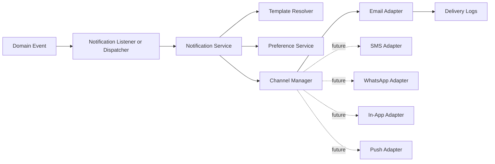

# Notification Architecture

Phase 7 introduces a provider-agnostic Notification Platform. Existing domains continue to emit domain events only; they do not send messages directly.

## Flow

## Modules

- `App\Domain\Notification\DTOs`: message, recipient, template, and delivery result data contracts.
- `App\Domain\Notification\Enums`: channels, categories, template status, notification status, and delivery status.
- `App\Domain\Notification\Interfaces`: repository, service, template resolver, channel manager, and adapter contracts.
- `App\Domain\Notification\Models`: templates, preferences, notifications, deliveries, and channel logs.
- `App\Domain\Notification\Services`: orchestration, template resolution, preference enforcement, and channel selection.
- `App\Infrastructure\Notifications\Email`: first concrete channel adapter.

## Decisions

The Notification Platform owns delivery. Wallet, Ledger, Payment, Product, and Verification modules should emit events and allow listeners to translate those events into `NotificationMessageData`.

Domain events that should trigger messages can implement `NotificationAwareEventInterface`. The `DispatchDomainNotification` listener queues the resulting message through `NotificationServiceInterface`, keeping provider delivery outside the source domain.

Email is implemented first. SMS, WhatsApp, In-App, and Push are represented as channels and contracts, but their adapters intentionally throw until their phases are approved.
