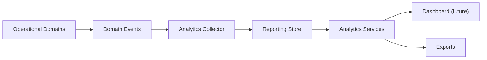

# Reporting Architecture

Phase 8 creates the read and analytics layer for IVP. Reporting consumes domain events and stores analytics-friendly records, snapshots, metrics, jobs, exports, and audit logs.

## Flow

## Boundary Rules

- Reporting must not own wallet, ledger, payment, verification, product, or notification business logic.
- Dashboards and exports should read `analytics_events`, `reporting_metrics`, and `reporting_snapshots`.
- Direct operational table queries are reserved for controlled backfill or reconciliation tasks, not normal dashboard rendering.

## Reporting Store

- `analytics_events`: normalized event facts from domains.
- `reporting_metrics`: calculated KPI values by period.
- `reporting_snapshots`: report payloads generated for dashboard/export reads.
- `reporting_jobs`: scheduled report framework.
- `reporting_exports`: export request tracking.
- `reporting_audit_logs`: audit trail for report actions.
