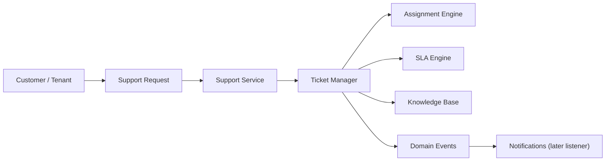

# Support Desk Architecture

Phase 9 introduces the Enterprise Support Desk Platform as the single source of truth for customer support operations.

## Flow

## Boundary Rules

- Support emits events only.
- Support never sends notifications directly.
- Support does not own wallet, payment, verification, product, notification, or reporting business logic.
- Attachments are metadata-only in Phase 9; file storage providers are not implemented.
- Sprint 2 Milestone 4 adds dashboard UI for tenant ticket submission and platform support operations.
- Live chat, AI assistant, marketplace, public API, and direct operational-domain mutation remain excluded.

## Main Components

- `TicketService`: ticket creation and lifecycle transitions.
- `AssignmentEngine`: manual, team, auto-framework, and escalation-ready assignment.
- `SlaEngine`: response/resolution target calculation and breach tracking.
- `TicketNoteService`: public and internal notes.
- `AttachmentMetadataService`: attachment metadata records.
- `KnowledgeBaseService`: article creation and publishing foundation.

## Sprint 2 Milestone 4 Web Workflow

The operational web layer uses thin controllers and `SupportDeskWorkflowService` to coordinate existing Support Domain services.

- Tenant users with support permissions can create tickets, view only their tenant tickets, and add public replies.
- Platform Super Admin users can view the enterprise queue, assign tickets, advance valid lifecycle statuses, and add internal notes.
- Internal notes remain staff-only and are not rendered in tenant views.
- Ticket creation, status transitions, assignment rules, SLA breach tracking, and note validation remain owned by the Support Domain.
