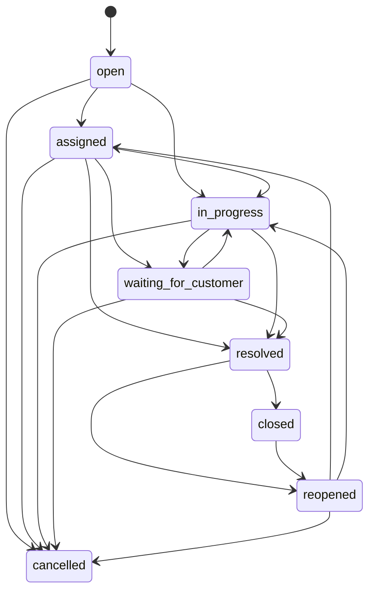

# Ticket Lifecycle

## Statuses

- `open`
- `assigned`
- `in_progress`
- `waiting_for_customer`
- `resolved`
- `closed`
- `reopened`
- `cancelled`

## Valid Transitions

Invalid transitions raise `InvalidTicketStatusTransitionException`.
